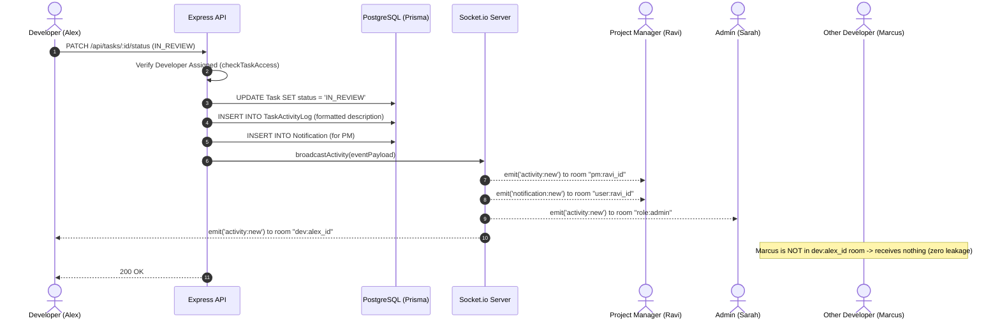

# Velozity Global Solutions — Real-Time Client Project Dashboard

[](https://www.typescriptlang.org/)
[](https://react.dev/)
[](https://nodejs.org/)
[](https://www.postgresql.org/)
[](https://www.prisma.io/)
[](https://socket.io/)

A full-stack enterprise web application built for **Velozity Global Solutions** to manage client projects, orchestrate team sprint tasks, and monitor company-wide activity in real time with strict Role-Based Access Control (RBAC).

---

## Technical Assessment Explanation (150–250 words)

> **Submission Explanation:**
> 
> The hardest problem solved was architecting the **real-time role-filtered live activity feed** alongside deterministic offline catchup without compromising API-level tenant isolation. Because Admins require a single global stream, Project Managers must only witness activity from their owned projects, and Developers must strictly observe tasks assigned to them, a naive broadcast would leak sensitive project data. 
> 
> To resolve this, we implemented an authenticated Socket.io room topology (`role:admin`, `pm:{pmId}`, `dev:{devId}`, `project:{projectId}`). Every task status mutation creates a persistent database audit row in `TaskActivityLog` before dispatching a structured payload targeting only the authorized rooms. For offline reconnection, the `/api/activity` endpoint enforces database-level SQL filter clauses using Prisma relations (`managerId = user.id` for PMs; `developerId = user.id` for Developers) rather than filtering in-memory, guaranteeing that client re-sync strictly returns the user's last 20 authorized events.
> 
> If we were to do one thing differently at hyper-scale (100k+ concurrent users), we would introduce Redis Pub/Sub with BullMQ rather than single-node `node-cron` and in-memory socket adapters. This would enable horizontal clustering across multiple backend nodes, distributed job deduplication for overdue tasks, and Redis Streams for high-throughput activity buffering.

---

## 1. Authentication & Role-Based Access Control (RBAC)

The application enforces a 3-tier role hierarchy:

| Role | API Permissions & Scope | Data Isolation Rules |
| :--- | :--- | :--- |
| **Admin** | Full system access: manage clients, projects, users, and tasks | Can inspect all global activity and system metrics |
| **Project Manager** | Create and manage projects, assign tasks to developers | Strictly restricted to projects they created (`managerId === user.id`). Cannot view or modify other PMs' projects |
| **Developer** | View assigned tasks and update status (`TODO` → `IN_PROGRESS` → `IN_REVIEW` → `DONE`) | Cannot view tasks assigned to other developers. Cannot modify task titles, descriptions, due dates, or assignees |

### Security Implementation Highlights
- **Dual-Token Authentication**: Short-lived JWT Access Token (15 mins) transmitted via `Authorization: Bearer <token>` in memory.
- **HttpOnly Refresh Token**: 7-day refresh token stored strictly in an `HttpOnly`, `SameSite=Lax`, `Secure` cookie — completely inaccessible to client JavaScript (mitigating XSS token theft).
- **Token Rotation & Revocation**: Refresh tokens are cryptographically hashed and verified against the database. Stale or reused tokens trigger automatic session revocation.
- **API-Level Enforcement**: Guaranteed via `authenticate`, `requireRole`, `checkProjectAccess`, and `checkTaskAccess` Express middlewares. Directly mutating token payloads or sending forged IDs yields `403 Forbidden`.

---

## 2. Real-Time Activity Feed Architecture



### Feed Specifications
- **Activity Description Format**: `"Ravi moved Task #12 from In Progress → In Review · 2 mins ago"`
- **Missed Events Catchup**: When an offline user reconnects, `/api/activity?limit=20` fetches the latest 20 events from the PostgreSQL database filtered by user role:
  ```sql
  -- For Developer:
  SELECT * FROM "TaskActivityLog" tal
  JOIN "Task" t ON tal."taskId" = t."id"
  WHERE t."developerId" = 'dev_user_id'
  ORDER BY tal."createdAt" DESC LIMIT 20;
  ```
- **Live User Presence**: Socket connections track active user sessions and broadcast real-time online user count updates.

---

## 3. Database Schema & Indexing Rationale

### Entity Relationship Diagram

```
+-------------------------------------------------------------+
|                            User                             |
+-------------------------------------------------------------+
| id (PK) | email (UQ) | passwordHash | role | refreshTokenHash |
+-------------------------------------------------------------+
       | 1                           | 1
       | manages                     | assigns
       v N                           v N
+------------------+         +--------------------------------------+
|     Project      |         |                 Task                 |
+------------------+         +--------------------------------------+
| id (PK)          |         | id (PK) | taskNumber (Auto)          |
| name             | 1     N | title | description                  |
| clientId (FK)    |-------->| status | priority                     |
| managerId (FK)   |         | dueDate | isOverdue                  |
+------------------+         | projectId (FK) | developerId (FK)    |
       | 1                   +--------------------------------------+
       | belongs to                      | 1
       v                                 | has
+------------------+                     v N
|      Client      |         +--------------------------------------+
+------------------+         |           TaskActivityLog            |
| id (PK)          |         +--------------------------------------+
| name | email(UQ) |         | id (PK) | taskId (FK) | userId (FK)  |
| company          |         | action | fromStatus | toStatus       |
+------------------+         | description | createdAt              |
                             +--------------------------------------+
```

### Indexing Strategy & Decisions

1. **`Task(projectId)` & `Task(developerId)`**:
   - *Rationale*: Project detail view queries `WHERE projectId = ?` and developer boards query `WHERE developerId = ?`. Without indexes, these queries would result in sequential table scans as task volume scales.
2. **`Task(dueDate, isOverdue, status)` Composite Index**:
   - *Rationale*: The scheduled background cron job executes every minute searching for `dueDate < NOW() AND isOverdue = false AND status != 'DONE'`. A composite index allows index-only scans for high throughput.
3. **`TaskActivityLog(createdAt DESC)`**:
   - *Rationale*: The live feed catchup query strictly requests `ORDER BY createdAt DESC LIMIT 20`. A descending B-Tree index guarantees $O(\log N)$ retrieval without sorting in memory.
4. **`Notification(userId, isRead, createdAt DESC)`**:
   - *Rationale*: Powers the unread badge count query (`WHERE userId = ? AND isRead = false`) and the dropdown list. Prevents locks and ensures instantaneous UI response.

---

## 4. Architectural Decisions & Justifications

### 1. WebSocket Engine: `Socket.io` vs Native WebSocket
- **Decision**: Selected **Socket.io**.
- **Justification**: While native WebSockets (`ws`) offer raw simplicity, Socket.io provides production-critical primitives required for enterprise dashboards:
  1. Built-in **Room multiplexing** (`socket.join('project:123')`), enabling clean separation between Admin global streams, PM project streams, and Developer direct updates without hand-rolling room management.
  2. Automatic **heartbeat ping/pong and reconnection with exponential backoff**, ensuring seamless reconnection when users toggle browser tabs or experience network blips.
  3. Seamless **connection handshake authentication**, allowing JWT verification before the socket connection is accepted.

### 2. Overdue Task Scheduler: `node-cron` vs Bull Queue
- **Decision**: Selected **node-cron**.
- **Justification**: 
  1. The assessment requirement is an internal agency dashboard with a single operational database. `node-cron` executes in-process with minimal overhead without requiring an external Redis infrastructure dependency.
  2. The cron job performs an atomic batch query with indexing (`dueDate < NOW() AND isOverdue = false`) and emits audit events.
  3. In a distributed multi-replica deployment, we can seamlessly migrate to **BullMQ with Redis lock** (described in the architectural explanation).

### 3. Refresh Token Storage: `HttpOnly` Cookie vs `localStorage`
- **Decision**: Stored in **`HttpOnly`, `SameSite=Lax`, `Secure` Cookie**.
- **Justification**: Storing tokens in `localStorage` leaves applications vulnerable to Cross-Site Scripting (XSS) extraction. Placing the refresh token in an `HttpOnly` cookie ensures browser sandboxing prevents client scripts from accessing the secret, while CSRF protection is enforced via `SameSite` flags and CORS origin restrictions.

---

## 5. Seed Data & Test Accounts

The included seed script (`npm run seed`) populates the database with:
- **1 Admin, 2 Project Managers, 4 Developers**
- **3 Real-World Enterprise Projects** with 16 total tasks
- **2 Tasks already in overdue state**
- **Pre-existing activity log entries** and sample notifications

### Pre-Configured Credentials

| Role | Name | Email | Password |
| :--- | :--- | :--- | :--- |
| **Admin** | Sarah Admin | `admin@velozity.com` | `Password123!` |
| **Project Manager** | Ravi Sharma | `ravi.pm@velozity.com` | `Password123!` |
| **Project Manager** | Elena Vance | `elena.pm@velozity.com` | `Password123!` |
| **Developer** | Alex Chen | `alex.dev@velozity.com` | `Password123!` |
| **Developer** | Marcus Miller | `marcus.dev@velozity.com` | `Password123!` |
| **Developer** | Priya Patel | `priya.dev@velozity.com` | `Password123!` |
| **Developer** | David Kim | `david.dev@velozity.com` | `Password123!` |

---

## 6. Local Setup Instructions

### Option A: Running with Docker (Recommended)

Make sure Docker and Docker Compose are installed:

```bash
# 1. Clone repository
git clone <your-repo-url>
cd velozity-project-dashboard

# 2. Launch complete stack (PostgreSQL + Backend + Frontend)
docker compose up --build
```
- Frontend: `http://localhost:5173`
- Backend API: `http://localhost:5000`
- PostgreSQL: `localhost:5432`

---

### Option B: Running Locally (Manual Setup)

#### Prerequisites
- Node.js v18+
- PostgreSQL database running locally or on cloud (e.g. Supabase, Neon, AWS RDS)

#### 1. Backend Setup
```bash
cd backend
npm install

# Configure environment
cp .env.example .env
# Edit .env with your DATABASE_URL

# Run Prisma migrations & seed data
npx prisma db push
npm run seed

# Start Backend development server
npm run dev
```

#### 2. Frontend Setup
```bash
cd ../frontend
npm install

# Start Vite development server
npm run dev
```

Open `http://localhost:5173` in your browser.

---

## 7. Known Limitations

1. **Single-Node Presence Tracking**: Active online user counts are tracked in-process via Socket.io connection sets. For horizontal multi-server autoscaling, an external Redis adapter (`@socket.io/redis-adapter`) would be added.
2. **PostgreSQL Specificity**: Relational foreign keys, cascade deletes, and composite indexes are optimized for PostgreSQL and Prisma ORM.
